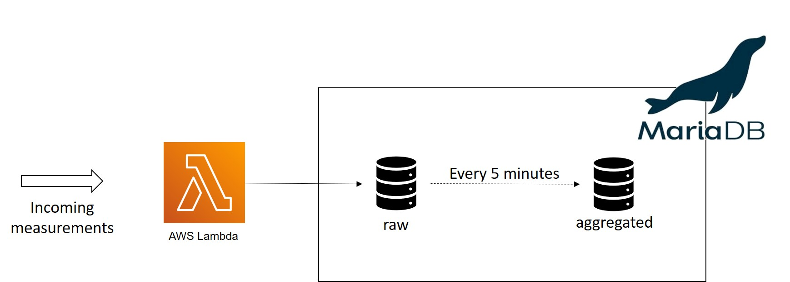

# Batch processing

These files explore the feasibility of processing the OpenAQ data in batches in a MariaDB database for monitoring the current air quality in Belgian cities.

## Data flow



New air quality measurements continue arrive and are ingested by an AWS Lambda function into a MariaDB database. An event scheduled on the database aggregates these events every 5 minutes to compute the air quality over the last three hours. 

## Setting up your development environment
To get this project up and running, make sure you have the following installed:
* Python 3
* PIP
* Docker (for local testing)

Create a virtual environment for this project. You can run this command in the terminal from the current folder `batch-processing` to install the required packages.
```
pip install -r requirements.txt
```

## Setting up your local test database
New features can be tested on a local database running as a docker container. 

Run the following command in this folder to create or start your database
```
docker-compose up
```

This will setup:

- MariaDB database on port 3306
- Adminer on port 8080

The first time you create the database, the scripts in the directory `queries/initialization/` are run in alphabetical order to initialize the database.  

To reset the database and test new initialization scripts add the option `-V`
```
docker-compose up -V
```
This recreates volumes used by the containers.

Connect to the database locally by logging in using adminer on
```
http://localhost:8080
```
with:

- host: db
- user: root
- password: password
- database: openaq

## Generating test data

You can generate test data by running the `generate-test-data.py` script via the terminal as

```python
generate-test-data.py <ingestion frequency per minute> <database configuration file>
```

- Ingestion frequency is optional and set by default to 100 measurements per minute
- When no database configuration file is supplied, data is ingested in the local MariaDB instance. Data can be ingested in another database by providing a configuration file. This file has the following structure:

```
DB_USERNAME = "..."
DB_PASSWORD = "..."
DB_HOSTNAME = "..." 
```

Make sure this file is listed in the .gitignore file, so your password isn't uploaded to github for everyone to see (and use).

