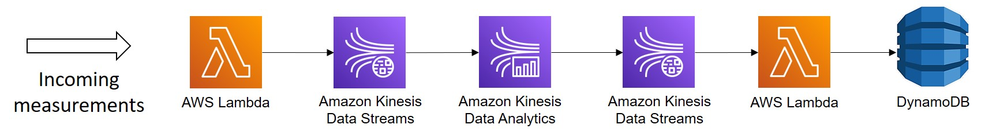

# Streaming

These files explore the feasibility of processing the OpenAQ data continuously using AWS kinesis.

## Data flow



New air quality measurements continue arrive and are ingested by an AWS Lambda function into a Kinesis Data Stream. A Kinesis Data Analytics application build using Apache-Flink continuously analyses the data stream and returns the aggregated air quality over the last three hours. A lambda helper function ingests these data points into a DynamoDB. 

## Setting up your development environment
To get this project up and running, make sure you have the following installed:
* Python 3.8 
* PIP
* An AWS config file is required to access your AWS resources via `boto3`

This project depends on the Python library Apache-Flink==1.15.2. There are installation issues for this library on newer versions of Python 3.9/3.10. It is therefore recommended to use Python 3.8 or lower.

Create a virtual environment for this project. You can run this command in the terminal from the current folder `streaming` to install the required packages.
```
pip install -r requirements.txt
```
## Generating test data

You can generate test data by running the `generate-test-data.py` script via the terminal as

```python
generate-test-data.py <Amazon Kinesis Stream Name> <ingestion frequency per minute>
```

- The name of the Amazon Kinesis Stream in which the data should be ingested is required. This stream should be accessible from your AWS account
- Ingestion frequency is optional and set by default to 100 measurements per minute

## Flink app

Code for the Apache-Flink streaming application is located in the folder `flink-app`. Run `deploy.sh` in Powershell to update the app on AWS.

## Lambda function to store the result in DynamoDB

Code for the lambda function storing the results is located in the folder `lambda-kinesis-to-ddb`. This lambda function depends on a single environment variable:
- `database`: Name of the DynamoDB database on AWS where the results should be stored